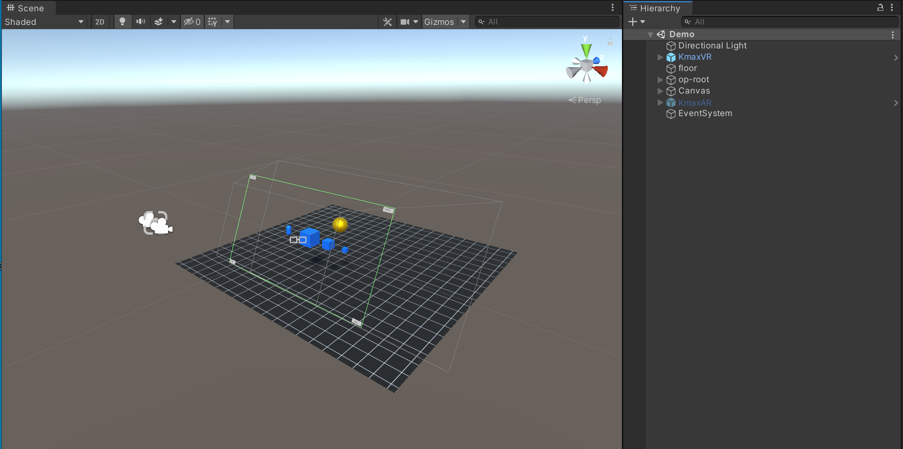

# KmaxXR SDK for Unity3d

## [文档](https://kmaxxr.github.io/com.kmax.xr/)

## Unity版本

sdk基于`unity2020.3`开发  

> 推荐开发者使用unity2019.1以上版本开发  
> 采用更低版本的unity需要开发者自行验证

## 示例

## 版本功能

- Windows平台下VR支持(仅kmax一体机设备)
- Windows平台下AR支持(需要配合外部摄像头及`Kmax AR`)

## 已知问题

- 编辑器中开启立体显示预览时game窗口将会变成浮动窗口，若强行将其停靠在编辑器主窗口上将关闭立体显示效果
